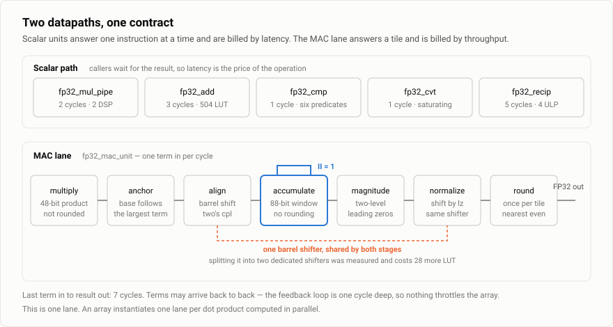
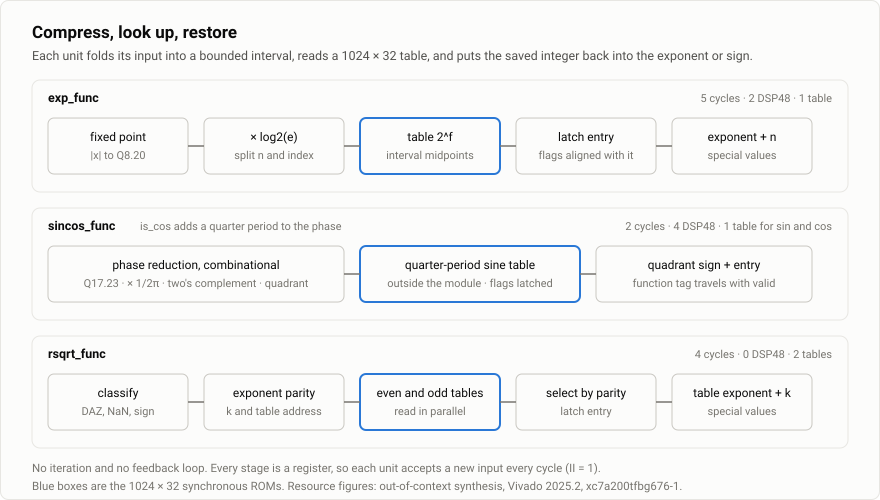
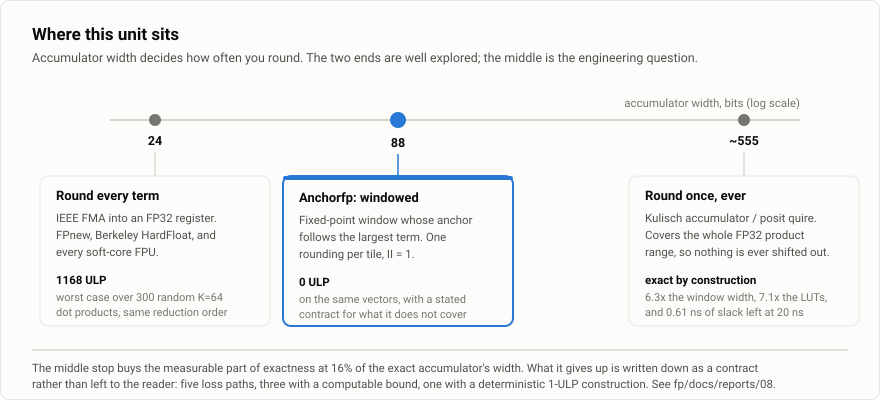
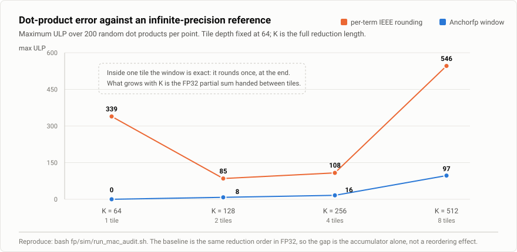
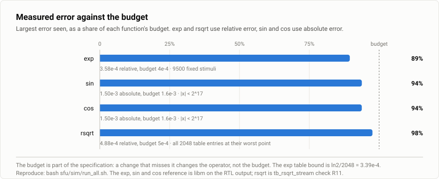
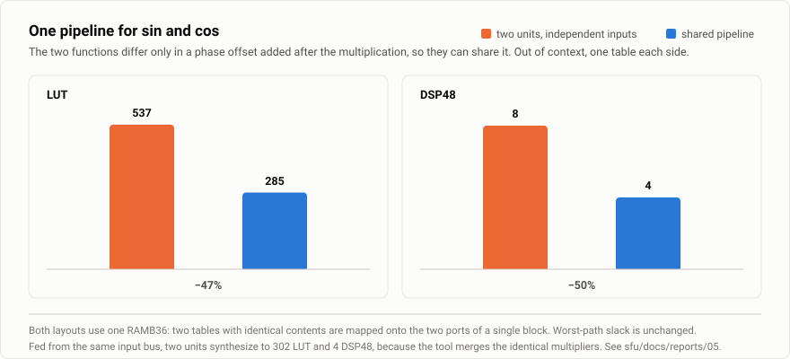
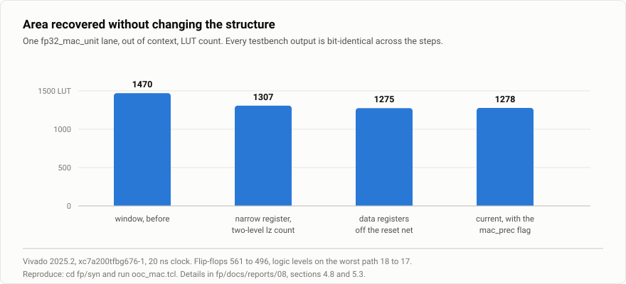

<div align="center">

# Anchorfp

An FP32 datapath for accelerators on FPGA: scalar arithmetic units, a fixed-point windowed multiply-accumulate unit, and transcendental function units

[](fp/rtl/)
[](fp/docs/reports/)
[](fp/sim/)
[](#fp-windowed-multiply-accumulate)
[](LICENSE)

[中文版 README](README.md) · this file is the English summary

</div>

---

This repository provides two groups of Verilog-2001 modules that can be used independently. Both follow
the same numeric conventions: denormal inputs are treated as zero (DAZ), tiny results are flushed to zero
(FTZ), and every NaN result is quiet.

- **fp**: five scalar units (add/subtract, multiply, compare, convert, approximate reciprocal) and a
  fixed-point windowed multiply-accumulate unit. Add, subtract, multiply, compare and convert are
  bit-identical to IEEE-754 binary32 round-to-nearest-even under FTZ semantics.
- **sfu**: exp, sin, cos and rsqrt, each built as domain compression, a 1024-entry table and field
  restoration. Results are approximate, with the error budget stated in the contract.

The target is an accelerator on an FPGA whose control core typically has no FPU, whose hot paths contain
scalar floating point, long dot products and transcendental functions, and whose logic budget is in the
tens of thousands of LUTs. The two main design decisions are: the multiply-accumulate unit replaces an FP32
accumulator with an 88-bit fixed-point window anchored to the largest term, rounding once per block; the
transcendental units replace iteration or polynomial evaluation with a fixed-latency table structure and
give each function a verifiable precision budget.

## Overview





| Directory | Module | Function | Latency | Resources (out of context, xc7a200t) |
|---|---|---|:--:|---|
| `fp/` | `fp32_add` | add and subtract; subtraction flips the sign of the second operand | 3 | 504 LUT / 147 FF |
| `fp/` | `fp32_mul_pipe` | multiply, significand product in DSP | 2 | 107 LUT / 66 FF / 2 DSP48 |
| `fp/` | `fp32_cmp` | six predicates on one unit, three-state result | 1 | 80 LUT / 3 FF |
| `fp/` | `fp32_cvt` | float and int32 both ways, saturating | 1 | 519 LUT / 33 FF |
| `fp/` | `fp32_recip` | approximate reciprocal, table plus one Newton step | 5 | 156 LUT / 176 FF / 4 DSP48 / 1 RAMB18 |
| `fp/` | `fp32_fpu_top` | routes by opcode to the five units above, no arithmetic | — | 1297 LUT / 425 FF in total |
| `fp/` | `fp32_mac_unit` | windowed multiply-accumulate, one rounding per block | 7 after the last term, II = 1 | 1278 LUT / 496 FF / 2 DSP48 |
| `sfu/` | `exp_func` | exponential | 5 | 290 LUT / 89 FF / 2 DSP48 / 1 RAMB36 |
| `sfu/` | `sincos_func` | sin and cos on one pipeline, selected per cycle | 2 | 285 LUT / 40 FF / 4 DSP48 / 1 RAMB36 (table included) |
| `sfu/` | `rsqrt_func` | reciprocal square root | 4 | 107 LUT / 92 FF / 2 RAMB36 |

Resource figures come from `fp/syn/ooc_units.tcl`, `fp/syn/ooc_mac.tcl` and `sfu/syn/ooc_sfu.tcl`
(Vivado 2025.2, `xc7a200tfbg676-1`, 20 ns constraint, netlist cell counts). Latency is the number of
cycles from the clock edge that samples `in_valid` to the edge that raises `out_valid`, measured and
asserted by the testbenches.

Pipelines are as shallow as timing allows. Behind a caller that waits for the result, latency is the price
of the operation, so one more adder stage costs one more cycle on every add; higher throughput comes from
instantiating several units. Every unit accepts a new input every cycle, so streaming callers are served
equally well.

Not provided: FP64 or FP16, correctly rounded division or square root, a denormal datapath, exception
flags, rounding modes other than round-to-nearest-even.

## Numeric contract

Commitments are tiered, in priority order. The full lists are in
[`fp/rtl/datapath-manual.md`](fp/rtl/datapath-manual.md) section 11 and
[`sfu/rtl/sfu-manual.md`](sfu/rtl/sfu-manual.md) section 5 (Chinese).

- **Tier A, non-negotiable.** Correct rounding for add, subtract, multiply, compare and convert within the
  domain; bit-identity with software floating point on the common domain; deterministic output; a true
  order relation for non-NaN comparisons; defined special-value propagation; elaboration-time checks for
  anything checkable at elaboration; every precision number in the documentation traced to a measurement
  with its stated range.
- **Tier B, stated deviations.** DAZ on input, FTZ on output with tininess detected after rounding;
  round-to-nearest-even only; no exception flags; quiet NaN results; reciprocal within 4 ULP;
  transcendental units within a relative error of 4e-4 for exp, an absolute error of 1.6e-3 for sin and
  cos, and a relative error of 5e-4 for rsqrt; the multiply-accumulate error bound below.
- **Tier C, performance, area and power**, ranked after the first two.

A deviation is a design decision if it can be stated in one sentence without "usually" or "mostly" and a
user can tell from it whether their data is affected; otherwise it is a defect. FTZ has 100% relative error
in the denormal range, but it is a rule with a clear boundary, so it qualifies.

## fp: scalar units

The multiplier has two stages and uses a 10-bit signed exponent so that overflow cannot wrap into
underflow; its unrounded 48-bit product is also the input of the multiply-accumulate unit. The adder has
three stages: align, add or subtract with leading-zero normalisation, round and pack. The comparator returns
-1, 0 or +1, and its `gt_family` input selects the direction returned for NaN so that both predicate
families evaluate to false; the three-state result is not a total order and must not be used directly as a
sort comparator. The reciprocal uses a midpoint-sampled 1024-entry table and one fixed-point Newton step,
is within 4 ULP and exact for powers of two, and is exposed only as an explicit operation, because IEEE 754
requires a correctly rounded quotient.

| Operation | Guarantee | Check |
|---|---|---|
| add, subtract, multiply | bit-identical to IEEE-754 binary32 under FTZ | 450k random vectors, 0 ULP; directed sticky-bit cases |
| compare | three-state result, NaN direction per family | ~200k random vectors + 32 directed |
| convert | both directions, saturating | 100k random vectors + 36 directed |
| reciprocal | within 4 ULP | 20k random vectors, tolerance check |
| denormals | flushed to signed zero on input and output | 283 directed cases |
| latency | every value measured, never derived from stage count | `tb_fp_lat`, 17 checks including contract mutations |

## fp: windowed multiply-accumulate

A general-purpose FPU rounds every term twice when it computes a dot product, so the error grows with
length. Against infinitely precise summation, K = 64, 300 cases per row:

| Stimulus | 88-bit window | same order, rounded per term in FP32 |
|---|---:|---:|
| regular | 0 | 1168 |
| very small values | 0 | 164 |
| wide spread (product exponents span 210 bits) | 0 | 79 |

An exact Kulisch accumulator covering every FP32 product under FTZ needs 555 bits. Setting `GrowW` from 15
to 482 in the same RTL produces it; in the same out-of-context flow the area grows 7.1x (1278 to 9106 LUT),
logic depth grows from 17 to 49 levels, and slack against 20 ns falls from 7.53 ns to 0.61 ns.



The window follows the running maximum under the invariant `B >= E + WinUp`. Its width is
48 (unrounded product) + 16 (`WinG`) + 8 (`WinFrac`) + 15 (`GrowW` for 32768 terms) + 1 (sign) = 88 bits.
Given a term bound N and a precision parameter, the width and certified precision Q are fixed by

```
AccW = 48 + WinG + WinFrac + ceil(log2 N) + 1
Q    = 46 + WinFrac − ceil(log2 N)
```

Sweeping `WinFrac` and `GrowW` from 81 to 96 bits leaves area and timing essentially flat (about 11% LUT,
logic depth fixed at 17, noise about ±5%); the cost rises steeply only on the way to 555 bits.

Writing `A = Σ|tᵢ|`, `S` for the exact sum and `Z` for the window value before the final rounding, the
contract is

```
|Z − S| < 2^(−Q) · A
```

The bound uses only the anchor invariant and holds under cancellation. Across 2352 prefix checks (5093
rescales, 1221 clears) the measured `|Z−S|·2³²/A` peaks at 3.36e-07. One deterministic construction loses
1 ULP when the shifted-out bits carry the rounding decision; the fix measured +194 LUT (+15.2%) and is not
unconditionally correct, so it is documented rather than implemented. A cancellation after an anchor reset
can remove the result entirely, which is inherent to any finite window that tracks the largest term; the
module raises `mac_prec` on that event only. Error across blocks comes from handing the partial sum over in
FP32, grows with the condition number, and has no block-count bound.



Calling contract, checked by simulation-only assertions C1 to C5: `prod_valid` spacing of at least
`FP32_MAC_PACE`, `last` aligned with the final term, no new products between the final term and
`out_valid`, measured last-term latency equal to `FP32_MAC_OUT_LAT_F(FuseMul)`, and at most `2^GrowW`
terms per block. The last one is also checked at elaboration through the `MaxTerms` parameter.

## sfu: transcendental function units

Each function compresses its input into a bounded interval while saving an integer, reads a 1024 × 32
synchronous ROM with a 10-bit address, and restores the saved integer into the exponent or the sign. There
is no iteration and no feedback loop.

- **exp_func** writes `|x| · log2(e) = n + f`, adds `n` to the exponent and looks up `2^f`. The table is
  sampled at interval midpoints, bounding the relative error by `ln2/2048 = 3.39e-4`; negative inputs map to
  `(−n−1, 1023−idx)`, which is tied to that sampling choice.
- **sincos_func** takes the fractional part of `|x| / (2π)` with one multiplication regardless of the
  angle, handles negative angles with a two's complement of the phase fraction, and stores a quarter period.
  Cosine is a quarter-period phase offset added after the multiplication, selected per cycle by `is_cos`.
  Finite inputs with `|x| >= 2^17` return the canonical qNaN rather than a plausible-looking number.
- **rsqrt_func** splits `1/sqrt(m · 2^e)` into `1/sqrt(m) · 2^(−e/2)`, folds the leftover `1/sqrt(2)` of odd
  exponents into a second table read in parallel, and takes the output exponent from the table entry itself.
  It contains no multiplier.



| Function | Metric | Budget | Measured maximum | Method |
|---|---|---|---|---|
| exp | relative error | 4e-4 | 3.579e-4 | 9500 fixed stimuli against libm |
| sin / cos | absolute error | 1.6e-3 | 1.501e-3 | same, `|x| < 2^17` |
| rsqrt | relative error | 5e-4 | 4.881e-4 | all 2048 table entries at their worst point |

Sharing one pipeline between sin and cos saves 252 LUT (47%), 34 FF and 4 DSP48 compared with two units fed
from independent inputs, with unchanged slack. When both units are fed from the same input bus the tool
already merges the identical multipliers and the saving shrinks to 17 LUT and 31 FF; sharing by structure
makes the saving independent of that optimisation.



The four tables are generated deterministically by `sfu/sim/gen_luts.py` together with JSON and Tcl
manifests. A missing table makes synthesis emit an uninitialised ROM with only a warning and makes
simulation read all X, so three checks guard it: `gen_luts.py --check` compares tables and manifests byte
for byte, `sfu/syn/check_sfu_luts.tcl` checks entry count, endpoints and SHA-256 before synthesis, and the
unit testbenches assert that no result contains X.

## Area recovery



Three bit-equivalent rewrites reduced one multiply-accumulate lane from 1470 to 1275 LUT with every
testbench output unchanged. One of them is a pattern worth knowing: data registers written in the `else`
branch of a reset block hold their value during reset, which is clock-enable semantics, so synthesis wires
`rst_n` into their CE pins. With 32 lanes instantiated, thousands of CE pins hang on one reset net and the
post-route worst path becomes a zero-logic route ending on a CE pin. A single out-of-context lane cannot show
it. `fp/syn/scan_reset_as_ce.py` finds the pattern in an RTL directory.

## Verification

- **Bit-exact golden models and independent references.** Scalar units are checked against IEEE-754
  results computed with C `float`. The multiply-accumulate unit has a bit-accurate model and an exact
  rational reference with independently written input decoding. The transcendental units use a frozen
  bit-exact reference to detect change and `sfu/sim/verify_sfu.py`, which computes errors against libm, to
  judge correctness; neither replaces the other.
- **Mutation testing.** Checks are themselves checked: five mutations of the multiply-accumulate golden
  model must each turn the bit-exact comparison red, and the sfu table-loading checks, the shared
  sin/cos tag logic and the flush path were verified the same way. A mutation that stays green means
  either a weak check or an unreachable path, and the two must be told apart.
- **Reporting layer.** Every entry script derives its exit code from a failure count and requires at least
  one pass marker, so it can gate CI directly.

## Running it

```bash
# needs iverilog >= 12, gcc, python3; verilator for lint; Vivado for synthesis
git clone https://github.com/f0d471/Anchorfp.git && cd Anchorfp

bash fp/sim/gen_vectors.sh      # golden vectors for the scalar units (derived data, not committed)
bash fp/sim/run_all.sh          # scalar units, multiply-accumulate configurations, latency checks
bash fp/sim/run_mac_audit.sh    # directed counterexamples, mutation tests, error reports
bash fp/sim/lint.sh

bash sfu/sim/run_all.sh         # table check, handshake forms, bit-exact comparison, independent reference
bash sfu/sim/lint.sh

cd fp/syn  && vivado -mode batch -source ooc_units.tcl -tclargs fp32_add
cd sfu/syn && vivado -mode batch -source ooc_sfu.tcl   -tclargs exp_func
```

Integration notes: opcode encodings live only in `fp/rtl/fp32_ops.vh`; latency constants live only in
`fp/rtl/fp32_lat.vh` and `sfu/rtl/sfu_lat.vh` and must be referenced by any alignment pipeline;
`bram_lut_1024x32` reads its `.mem` file by bare name, so synthesis must be able to find it (see `read_mem`
in the `syn/` scripts) and simulation must run in a directory containing it; the sine table of
`sincos_func` is instantiated by the caller.

## Repository layout

```
common/      bram_lut_1024x32.v, the 1024-entry synchronous ROM shared by fp and sfu
fp/          rtl/ (units, manual), sim/ (generators, testbenches, scripts), syn/, docs/reports (8 chapters), docs/figures
sfu/         rtl/ (units, tables, manifests, manual), sim/, syn/, docs/reports (5 chapters), docs/figures
```

## Related work

[FPnew / cvfpu](https://github.com/openhwgroup/cvfpu) and
[Berkeley HardFloat](http://www.jhauser.us/arithmetic/HardFloat.html) are IEEE-compliant general-purpose
implementations. [FloPoCo](https://flopoco.org/) is an FPGA operator generator that includes exact
accumulators. Short-pipeline FP32 add and multiply, GRS rounding, table-plus-Newton reciprocals and
table-based transcendental functions are established techniques. Exact fixed-point accumulation is
Kulisch's work, and its FPGA design space was mapped by de Dinechin and colleagues
([Design-space exploration for the Kulisch accumulator](https://hal.science/hal-01488916v2),
[Floating-Point Accumulation and Sum of Products](https://doi.org/10.1007/978-3-031-42808-1_21)).

This repository contributes the point between exact accumulation and per-term rounding, an anchored 88-bit
window in a one-cycle feedback loop fused with an unrounded multiplier, together with a measured and
stated contract for what the window loses; and, for the approximate transcendental units, precision
budgets, reproducible table generation and table-loading checks. The engineering reports, including
rejected designs and corrected conclusions, are written in Chinese.

## License

[Solderpad Hardware License v2.1](LICENSE)

SPDX identifier: `Apache-2.0 WITH SHL-2.1`
