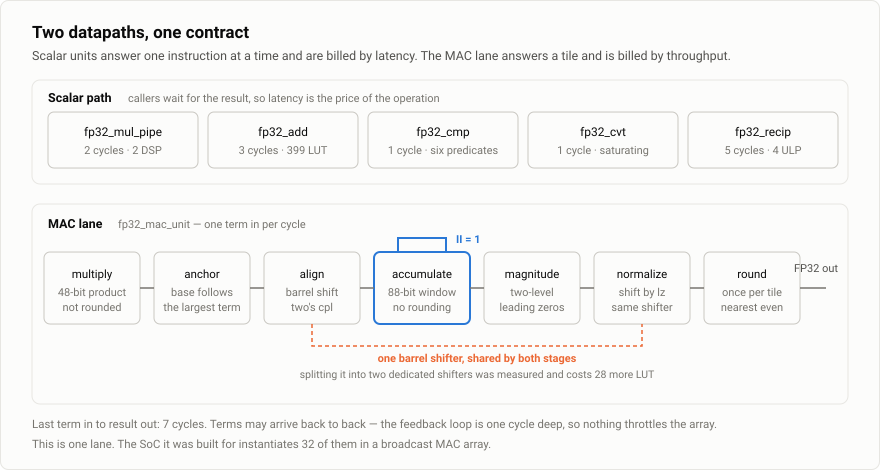
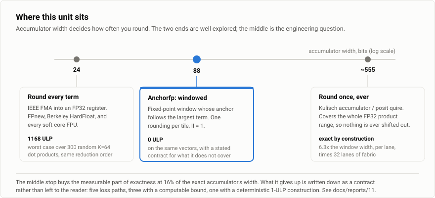
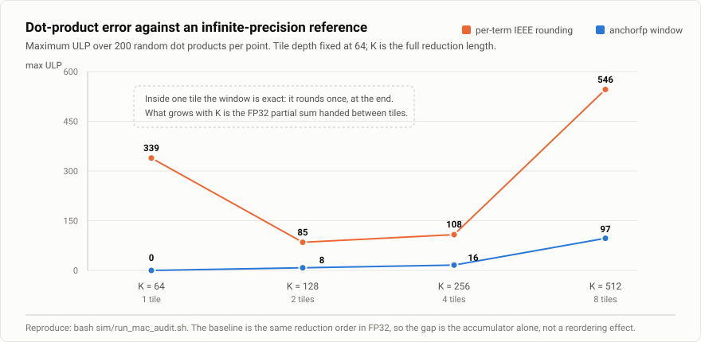
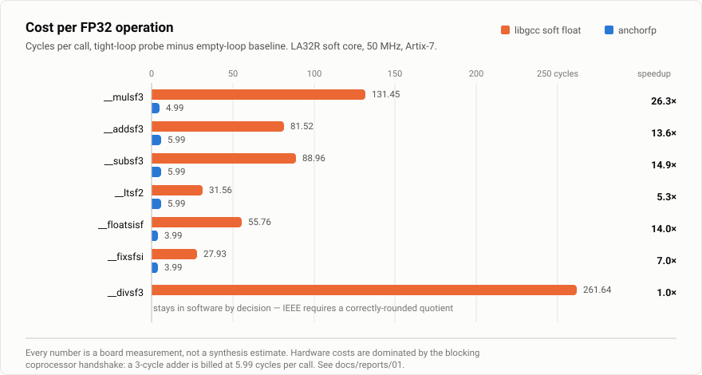
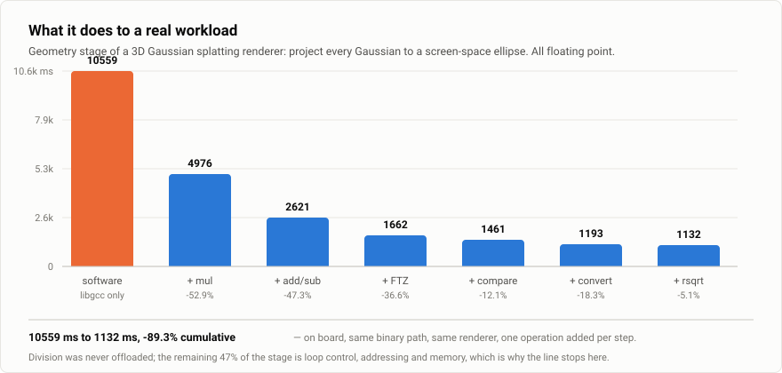
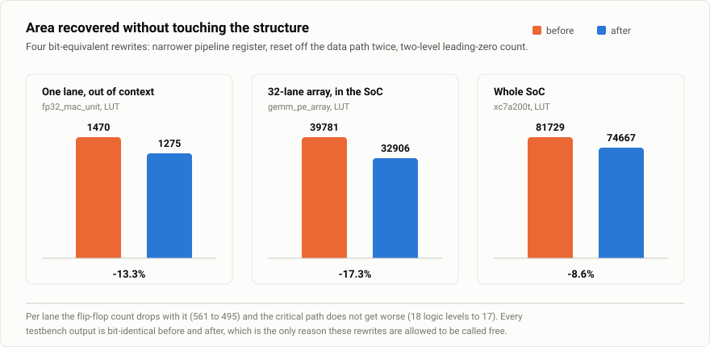

<div align="center">

# Anchorfp

FTZ 语义下的一套 FP32 通路，给 FPGA 上的边缘加速器用

[](rtl/)
[](docs/reports/)
[](sim/)
[](#3-点积那条线)
[](LICENSE)

[English summary](README.en.md)

</div>

---

在 FPGA 上搭一个加速器，旁边总要放一颗控制核。这颗核多半没有浮点单元，
于是 C 代码里一次浮点乘法要靠整数指令模拟出几十上百个周期。
补这个洞不需要什么新东西：加法器、乘法器、比较器、类型转换、一个近似倒数，
按教科书做出来接上去就行。这个仓库里的六条标量运算就是这样做的，
它们在 FTZ 语义下逐位等于 IEEE-754 binary32，没有别的花样。

真正需要想一想的是点积。矩阵乘、卷积、投影这些负载底下都是长点积，
而点积不是"把乘法器和加法器串起来"那么简单：串起来每算一项就要舍入一次，
误差随长度累积。这个仓库在这里做了一个取舍，用一把 88 位的定点尺子代替 FP32 累加器，
一块之内不舍入。第 3 节讲这把尺子为什么是 88 位。



导航：[定位](#1-定位) · [标量六条](#2-标量六条) · [点积那条线](#3-点积那条线) ·
[结果](#4-结果) · [判死的实验](#5-判死的实验) · [验证方法](#6-验证方法) ·
[快速开始](#7-快速开始) · [仓库结构](#8-仓库结构) ·
[与其他开源实现](#9-与其他开源实现的关系) · [文档](#10-文档) · [许可证](#11-许可证)

---

## 1. 定位

做给 FPGA 上的边缘加速器。这个场景有三条约束，和给 ASIC 做通用 FPU 不一样：
控制核常常没有 FPU，热点里标量浮点和长点积都有，资源预算是几万个 LUT。

七个模块可以单独例化，也可以只拿其中一个：

| 模块 | 做什么 | 延迟 | 资源（离线综合，xc7a200t） |
|---|---|:--:|---|
| `fp32_add` | 加与减，减法由调用方取反符号位 | 3 拍 | 399 LUT / 147 FF |
| `fp32_mul_pipe` | 乘，尾数积走 DSP | 2 拍 | 98 LUT / 66 FF / 2 DSP |
| `fp32_cmp` | 六个谓词共用一个 op，三态返回 | 1 拍 | 组合逻辑 |
| `fp32_cvt` | 浮点与 32 位整数互转，越界饱和 | 1 拍 | 组合逻辑 |
| `fp32_recip` | 近似倒数，查表加一轮牛顿 | 5 拍 | 含一块 1024x32 ROM |
| `fp32_fpu_top` | 按 op 路由到上面五个，不含算术 | — | — |
| `fp32_mac_unit` | 定点窗口点积，一块一次舍入 | 末项后 7 拍，II=1 | 1275 LUT / 495 FF |

五个计算单元互相独立，不需要 `fp32_fpu_top` 这一层也能用。
`fp32_mac_unit` 与它们并列，不经路由层。

流水切得很浅是有意的。目标场景里调用方多半会停下来等结果，
延迟就是这条运算的价格，加法器多切一级，每一次浮点加法都多付一拍。
所以准则是把每个单元的延迟压到能跑出频率的最小值，
而不是常见的切深流水换频率。要更高吞吐就并起来多例化几份，不是把单个单元切深。

不做的东西也说清楚：只有 FP32，只有 FTZ，没有除法、没有开方、
没有 FP64/FP16、没有异常标志位。

## 2. 标量六条

这一节没有新东西，列在这里是为了让使用者知道自己拿到的是什么。

乘法器分五步：三个字段本来各自独立，只有尾数积溢出到阶码、
以及位数装不下这两处会互相干扰，各生出一步，加上特殊值分流，正好五步。
阶码用 10 位带符号数省掉一次范围判断，舍入走 GRS 而不是截断，截断有系统性偏差。
加法器三级，由"小数点必须对齐"推出对阶，由"加减之后范围失控"推出规格化，再加舍入组装。
比较器和转换器各一级。倒数是查表加一轮牛顿迭代，表里存区间中点而不是端点，
误差从 16011 ULP 压到 4 ULP，2 的幂另有特判。

承诺与判据：

| 运算 | 保证 | 判据 |
|---|---|---|
| `FMUL` `FADD` `FSUB` | FTZ 语义下逐位等于 IEEE-754 binary32 的最近偶数舍入 | 45 万条随机向量，0 ULP，100% |
| `FCMP` | 六个谓词共用一个 op，NaN 按无序语义处理 | 20.08 万条随机向量 + 32 条定向 |
| `FCVT` | 浮点与 32 位整数互转，越界饱和到端点 | 10.0 万条随机向量 + 36 条定向 |
| `FRECIP` | 近似倒数，误差不超过 4 ULP | 2 万条随机向量，容差判据 |
| 亚正规数 | 输入与输出一律 flush to zero，符号保留 | 283 条定向用例 |
| 延迟 | 表中各值是实测量，不由流水级数推算 | `tb_fp_lat` 17 条，含契约注错 |

三个细节容易被忽略。

比较器返回三态而不是布尔。小于、等于、大于、无序四种情形要分开，
拿它当布尔比会得到"只有对角线匹配"这类假象。

FTZ 是硬件入口的语义，也是这套通路对 IEEE-754 唯一的偏离。
亚正规数在软件模拟里要走一条昂贵的分类分支，硬件把它统一冲成零，符号保留。
283 条定向用例专门盯这条契约，包括最小正亚正规、最大亚正规，
以及那个常被误标成"最小规格化数"的 `0x00400000`。

`FRECIP` 只经显式调用暴露，不用来替换 `/` 运算符。IEEE 要求除法正确舍入，
拿近似倒数换掉除号，会让已经编译好的程序悄悄改变结果。

## 3. 点积那条线

### 3.1 把乘法器和加法器串起来会怎样

一个通用 FPU 算点积的办法是：乘一项，舍入成 FP32，加进累加器，再舍入成 FP32。
累加器只有 24 位有效位，每一项都要舍两次，误差随着长度累积。

实测一下。K=64 的点积，与无限精度求和比对，每档 300 组随机激励：

| 激励 | 88 位窗口 | 逐项舍入的同序 FP32 |
|---|---:|---:|
| 常规 | 0 | 1168 |
| 极小值 | 0 | 164 |
| 宽跨度（乘积阶码跨 210 位） | 0 | 79 |

右边那一列就是"套用现成的 fmul 加 fadd"能拿到的结果。
它不是坏实现，通用 FPU 本来就是这样定义的；只是把它放进以点积为热点的加速器里，
误差会一路长上去。

### 3.2 另一端：一位都不丢

反方向的做法是把累加器做得足够宽，宽到 FP32 全指数范围内任何一项都能原样放进去，
全程不舍入，最后一次性舍成 FP32。这是 Kulisch 在 1970 年代的想法，
posit 的 quire 是它的标准化版本。

这把尺子要多长可以算出来。FTZ 语义下两个 FP32 相乘，最小的非零乘积是 2⁻²⁵²，
它的最低有效位落在 2⁻²⁹⁹；最大乘积不到 2²⁵⁶。一位不丢，
就得把这两端之间的每一位都排上，一共 555 位。

同一份 RTL，把 `GrowW` 参数从 15 调到 482 就得到这把 555 位的尺子。
同一个综合流程、同一颗器件（xc7a200t-1，20 ns 约束，OOC 单 lane）量出来：

| 窗口宽度 | LUT | FF | WNS | 逻辑级数 |
|---:|---:|---:|---:|---:|
| 88 | 1278 | 496 | 7.528 ns | 17 |
| 555 | 9106 | 1956 | 0.605 ns | 49 |

面积是 7.1 倍，但更要紧的是右边两列：逻辑级数从 17 涨到 49，
20 ns 的余量从 7.53 ns 掉到 0.61 ns。精确累加不只是费面积，它同时把频率吃掉，
而这条加法链在反馈环里，环上多一拍整个吞吐就掉一半。
（这两行是宽度扫描那一轮的数，比第 4.4 节的现状早一轮面积回收。）



### 3.3 中间那把尺子：88 位

555 位里的绝大多数位其实用不上。一个点积里真正决定结果的是量级相近的那些项：
比最大项小 2⁻⁴⁰ 的项加进去，根本推不动结果的最低位。
全指数范围的尺子是为"任意一项都可能出现"准备的，
而一次求和实际用到的是一段窗口，不是整根尺子。

所以让窗口跟着最大项走。基准 B 随着运行最大值上抬，
不变式是 `B >= E + WinUp`，累加器同拍算术右移同样的位数，
窗口之下的部分才被丢掉。剩下的问题是这扇窗要开多宽。

88 位是四样东西加起来的，每一样都有独立的来源：

```
 48   两个 binary32 尾数相乘的未舍入积，24 x 24
 16   WinG，基准量子化之后最大项落点的区间宽度
  8   WinFrac，最大项最低位之下留的位，决定认证精度 Q
 15   GrowW = ceil(log2 N)，一次累加最多 32768 项的求和增长
  1   符号
 ---
 88
```

48 那一行是这套设计的前提：乘积不先舍入。乘法器级 1 出来的 48 位原始积直接进窗口，
不经过 FP32 那道舍入。这是"融合乘加"的意思，也是 3.1 节右边那一列和左边一列的差距来源。
同一批向量下，把乘积先按 IEEE 舍一次再进窗口，最大误差从 0 变成 1027 ULP。

16 和 8 那两行是窗口本身：基准按 16 位的量子上抬，所以最大项的落点在一个 16 位宽的区间里浮动；
再往下留 8 位，是给对齐移位丢掉的信息留的余地。

15 那一行是求和本身要求的。N 项相加最多让结果长 ⌈log₂N⌉ 位，
32768 项就是 15 位。这一位不留，累加器会在长序列上溢出。

### 3.4 为什么 88 不是一个魔数

反过来读上面那张表，就是这把尺子的规格。给定项数上限 N 与目标精度 Q，
宽度由两条式子定死，没有可调的余地：

```
AccW = 48 + WinG + WinFrac + ceil(log2 N) + 1
Q    = 46 + WinFrac − ceil(log2 N)
```

Q 的含义是这条界：记 `A = Σ|tᵢ|` 是输入的绝对和，`Z` 是末项舍入之前的窗口值，
`S` 是精确和，则恒有

```
|Z − S| < 2^(−Q) · A
```

契约给的是这条式子，不是一个数。默认 `WinFrac = 8` 时，
`N ≤ 255` 得 `Q = 46`，`N ≤ 4096` 得 `Q = 42`，`N ≤ 32768` 得 `Q = 39`。
项数越多界越松，这是求和增长本身的代价，与实现无关。

所以 88 只是默认档，对应 32768 项那一档。
只做 255 项的使用者把 `GrowW` 传成 8，同样的 `Q = 46` 只要 81 位；
要覆盖 FTZ 全域就传 482，退回 3.2 节那把 555 位的精确累加器。
同一份 RTL 覆盖整条设计空间，88 是其中一个点，不是一个凑出来的常数。

公式定死了 88，但公式本身不回答这个点值不值。把 `WinFrac` 与 `GrowW` 各扫一遍
（同一份 RTL、同一个 OOC 流程、xc7a200t-1、20 ns 约束）：

| AccW | 认证精度 Q | LUT | FF | WNS | 逻辑级数 |
|---:|---:|---:|---:|---:|---:|
| 81 | 32 | 1215 | 475 | 7.333 ns | 17 |
| 84 | 35 | 1359 | 488 | 7.528 ns | 17 |
| 88 | 39 | 1278 | 496 | 7.528 ns | 17 |
| 92 | 43 | 1321 | 508 | 7.528 ns | 17 |
| 96 | 47 | 1348 | 520 | 7.200 ns | 17 |

81 到 96 位这一段是平的：15 位精度换 10.9% 的 LUT，时序一动不动，级数恒为 17
（相邻两档的非单调说明这个扫描的噪声在 ±5%）。
换 `GrowW` 得到同样的形状，LUT 只由 `AccW` 决定，
与这些位是分给精度还是分给容量无关。

这也是为什么不该把 88 讲成"在精度与面积之间折中"，在这一段里根本没有值得折的东西。
真正的悬崖在通向 555 位的路上。88 位的位置是平坦段上任取一点，
而它取在这里的理由是上面那两条式子，不是曲线的形状。

式子里没有 `WinUp`。不变式 `B >= E + WinUp` 保证任何单项对齐之后的最高位
都不超过 `TW−1−WinUp`，窗口顶上那 `WinUp` 位不是项的落点，
本来就是求和增长的空间。这一点此前被算漏过一次，
把项数上限说成了 255，见 [docs/reports/10](docs/reports/10-FP32乘累加换成定点窗口累加器.md) 第 3.3 节。

### 3.5 窗口丢掉的是什么

一项要进窗口，得先右移到共同刻度上。会丢信息的地方一共五处，逐条量过：

| # | 路径 | 结论 | 依据 |
|---|---|---|---|
| 1 | 对齐右移，移出窗口的低位 | 落在 3.4 那条界里，够不着结果最低位 | 可算的界，另有 254 项最不利构造实测 0 ULP |
| 2 | 抬基准时累加器整体右移 | 同上量级，实测 0 ULP | 反复换基 200 余次的定向向量 |
| 3 | 负数右移的截断方向与正数相反 | 无系统性偏差 | 64 对镜像向量严格反号，一对不差 |
| 4 | 移出的位里含决定进位方向的信息 | 会稳定地差 1 个 ULP | 64 条定向构造里 56 条复现，不修，理由见下 |
| 5 | 基准重锚清空旧和之后发生抵消 | 结果可以整个丢掉 | 结构固有代价，但仍落在那条界里 |

那条界只用到基准的不变式，不依赖任何"保护位固定多少"的假设，
所以第 5 条那种抵消场景它照样成立：`S` 变小的时候 `A` 不变小。
使用者拿到的是一个恒成立的不等式，而不是一句"这种情况我们不管"。
代价是验收要按绝对误差与输入尺度检查，不能要求接近零的 `S` 仍保持固定的相对误差。
2352 组逐前缀检查（含 5093 次换基、1221 次清空）实测 `|Z−S|·2³²/A` 最大 3.36e-07。

> 这里曾经写的是"累计量 < 2⁻⁴⁰ ULP"，那条推导用了一个不成立的前提，
> 即最大项的对齐移位量恒为 8、其下固定有 24 位保护位。基准按 16 位的量子上抬，
> 移位量实测能取到 23，保护位最少只剩 9 位。结论方向没变，支撑它的推导换掉了。
> 一个错误的推导配一个正确的结论比错结论更难发现，因为使用者会照着推导算自己的数据。

第 4 条不修的理由有两条。修法是让移位器额外报出一个粘滞位，实测多花 194 个 LUT（+15.2%），
刚好把第 12 章那四条面积回收省下的 195 个 LUT 花光；
而且一个布尔粘滞位恢复不了被丢残差的符号，正负项抵消时它可能把结果推向错误的方向。
花掉全部面积收益，换来的还不是正确性。真要那一个 ULP，正解是把尺子加长到覆盖整个指数范围，
那是 3.2 节那个设计点。

第 5 条不是这个实现特有的：任何基准跟着最大值走、长度又有限的累加器都有这一条。
除了写进契约，模块还引出一位 `mac_prec`，在基准重锚时逐块置位，供调用方汇总。
它只报这一类，不报普通对齐丢位，因为一个恒为真的信号没有信息量，
所以它的核心判据是反面的那条：普通抬基准时必须不置位。

完整推导、反例构造与判据的反证在
[docs/reports/11](docs/reports/11-定点窗口累加器的误差边界.md)。

### 3.6 跨块

一块算完，部分和转回 FP32 再进下一块，转一次舍一次。
这笔账属于分块接口，不属于累加器：

| K | 块数 | 88 位窗口 | 逐项舍入的同序 FP32 |
|---:|---:|---:|---:|
| 64 | 1 | 0 | 339 |
| 128 | 2 | 8 | 85 |
| 256 | 4 | 16 | 108 |
| 512 | 8 | 97 | 546 |

这张表不要配"按块数算"的上界。分块求和的误差正比于条件数，而条件数没有上界，
任何形如"n 块最多 n 个 ULP"的说法都是错的。要设闸门只能拿实测值加余量当回归基线。

### 3.7 调用契约

网表里不检查，仿真时有断言接住（`rtl/fp32_mac_assert.vh`，C1 到 C5 各带独立计数器）：

1. 相邻 `prod_valid` 的间隔不小于 `FP32_MAC_PACE`（当前为 1，恒成立）。
2. `last` 与末项的 `prod_valid` 同拍。
3. 末项之后到 `out_valid` 之前不许再喂积。这一段流水里还有在飞的项，
   而模块内部没有任何忙标志是高的，只盯忙标志的断言抓不到。
4. 末项到 `out_valid` 的实测拍数等于 `FP32_MAC_OUT_LAT_F(FuseMul)`。
5. 一次累加进窗口的项数不超过 `2^GrowW`，默认 `GrowW = 15` 即 32768 项。
   超了不是立刻绕回，是进入没有论证过的区域。

第 5 条另有一道更早的防线：`MaxTerms` 参数。调用方声明自己每块最多喂多少项，
超过认证上限就在例化期报错。分块深度是综合前完全确定的常量，
让它跑到仿真才发现，属于能在编译期查却没查。两道各管一段。

端口级的完整手册在 [`rtl/datapath-manual.md`](rtl/datapath-manual.md)，与 RTL 放在一起。

## 4. 结果

以下数字来自 Vivado 2025.2、`xc7a200tfbg676-1`、20 ns 时钟（50 MHz）。
换器件、换工具版本都会变，不要当常数抄走。

### 4.1 精度

标量侧是逐位判据，没有容差可言：

| 判据 | 结果 |
|---|---|
| `tb_fp32_add` | 25 万向量，0 ULP，100% |
| `tb_fp32_mul` | 20 万向量，0 ULP，100% |
| `tb_fp32_cmp` / `tb_fp32_cvt` | 32 / 36 条判定，0 FAIL |
| `tb_fp_ftz` / `tb_fp32_denorm` | 25 条 / MUL 173、ADD 110，0 FAIL |
| `tb_fp32_recip` | 21 条，容差 4 ULP，0 FAIL |

点积侧只能谈相对误差，参照是无限精度求和，数据见 3.1 节与下图。



### 4.2 每次运算的周期数



"软件"一列是没有 FPU 的核用整数指令模拟一次浮点运算的周期数，
"硬件"一列是这套通路的实测单价，含调用方等待结果的握手开销，
所以 3 拍的加法器算成 5.99 拍。

### 4.3 接上去之后



一个三维高斯溅射渲染器的几何级，把空间中的高斯点投影成屏幕上的椭圆，全是浮点。
逐个工作点实测，每一步只加一种运算，从 10559 ms 降到 1132 ms。
这条曲线整条都是标量线的，点积累加器不在这条路径上。

它停在 1132 ms，是因为再往下的账已经不属于浮点：重新拆账之后，
循环控制、寻址、访存、整数分支合计占 47%，是最大单项（乘法 18.5%）的 2.5 倍，
而乘法的 4.99 拍已经是硬件价。列在这里是为了说明这套通路能吃掉多少，
以及吃完之后剩下的是什么。

### 4.4 面积



有一轮改动专门回收面积，四条全部逐位等价，所有判据的输出一位不变。
最值得单说的是最后一条，因为它是个容易复发的写法问题：
数据寄存器写在复位块的 `else` 分支里，复位期间保持不变，
而"保持不变"正是时钟使能的语义，于是综合器把 `rst_n` 接成了这一整组寄存器的 CE。
88 位乘 32 条 lane，几千个使能端挂在一根网上，
布线后的最差路径变成零级逻辑、纯布线、终点是 CE 脚，阵列 setup 余量只剩 0.053 ns。
拆开之后回到 1.550 ns。

单 lane 离线综合量不出这个问题（1275 对 1277，在噪声里），
因为 88 个使能端算不上高扇出，要例化多份才看得见。
`syn/scan_reset_as_ce.py` 能把这个写法从整个 rtl 目录里扫出来，本仓已经不在它的输出里。

时序这条线上还有一次更早的修复，对象是标量加法器，hold 余量掉到 0.010 ns，
最差路径是一条零逻辑裸传。修法是把一个窄信号重建成必须穿过一级逻辑的形式，
余量回到 0.028 ns，数值等价由定向用例守着。顺带把准入门槛从"余量 ≥ 35 ps"
改成"全项 MET 且最差路径不落在零逻辑裸传上"，因为余量这个数会随布局波动，
而路径的形态不会。全程见
[docs/reports/09](docs/reports/09-FP32数据通路的hold时序修复.md)
与 [docs/reports/12](docs/reports/12-不改结构的面积回收.md)。

## 5. 判死的实验

判死的实验也列在这里，每一条都有数。

标量线：

| 想法 | 实测 / 依据 | 结论 |
|---|---|---|
| 用近似倒数替换 `/` 运算符 | 会悄悄改变已编译程序的结果 | 不做，只给显式调用 |
| 做一个正确舍入的迭代除法器 | 代价超过收益，除法在目标负载里占比不足 | 不做，除法留在软件 |
| 支持亚正规数 | 软件侧的分类分支很贵，硬件侧要多一条规格化路径 | 不做，改为 FTZ 并写进契约 |
| 舍入用截断（省一级加法） | 截断有系统性偏差 | 不做，走 GRS |
| 靠余量数字当时序准入门槛 | 余量随布局波动，路径形态不会 | 门槛改成看最差路径的形态 |

点积线：

| 想法 | 实测 | 结论 |
|---|---|---|
| 把共享的桶形移位器拆成两个专用的 | +28 LUT | 不做，共享是对的 |
| 给对齐移出位补粘滞位（修那 1 个 ULP） | +194 LUT（+15.2%），且非无条件正确 | 不做，写进契约 |
| 环内换成进位保存累加器 | LUT +24.4%、FF +22%，且与默认档并不逐位等价 | 撤出支持集合，例化期挡住 |
| 按流水级把 597 行的 MAC 拆成多个模块 | 面积不变，接口复杂度上升 | 只把仅仿真的断言外提（−66 行） |
| `rescale` 的档位数写死省一层多路器 | 个位数 LUT | 不做，不拿通用性换这点面积 |

按流水级拆模块那一条多说一句。共享移位器横跨两个相隔很远的流水级，
按级拆就得把它提成独立模块再加一层仲裁接口，相邻两级之间要传七组信号，
而综合器看不见跨模块的常量传播。横向对照，`cvfpu` 的 `fpnew_fma.sv`
也是同一量级的单文件数据通路。

进位保存那一条翻过案。这里原来写的是"与默认档逐位相同，无收益"，
而且有一档回归专测这件事，一直是绿的。后来换成会发生抵消的激励，
64 组里立刻有 10 组不同：基准上调时两个分量各自算术右移、分别截断再相加，
不等于先相加再截断。判据没错，它老实比对了它拿到的那份激励；
错的是没人规定过这句话该用什么激励去验。

## 6. 验证方法

分三层，缺一层就有一类缺陷抓不住。

逐位金标准。每个单元对着一份独立参照跑，参照是宿主机的 IEEE-754
（`sim/gen_*_vectors.c` 用 C 的 `float` 算期望值）。窗口累加那一档另有两层模型：
一层逐位复刻硬件，一层用有理数精确求和后一次正确舍入。
两层原来共用同一份位型解释与乘积构造代码，那等于只有一层，
那份代码若有错两层会一起错。拆开各写一份之后，把第一层的乘积阶码改坏一位，
两层对拍从 maxULP 0 变成 139809444，这个数才是两层真的独立了的证据。

注错见红。判据自己也要被验一次。把金标准改坏五处（补粘滞位、换基改对称截断、
清空档改成不清、末项舍入改截断、尺子加长八位），逐位对拍必须当场红。
第一次跑，五个里有四个没红，追下去发现判据没坏，是配错了激励。调整之后五个全红：

```
==== 注错见红：金标准被改坏时上面那五条判据必须当场红 ====
  align_jam            注错见红 (56 组不匹配, 用 halfway 向量) -> PASS
  rescale_rtz          注错见红 (16 组不匹配, 用 cancel 向量) -> PASS
  clr_keep             注错见红 (32 组不匹配, 用 cancel 向量) -> PASS
  pack_trunc           注错见红 (72 组不匹配, 用 mirror 向量) -> PASS
  win_pad              注错见红 (56 组不匹配, 用 halfway 向量) -> PASS
```

由此得到一条判断：一次注错不红有两种可能，判据烂了，或者那条路径在当前激励下不可达。
不区分这两种，就会去修一个本来没坏的判据。同一条规矩也用在别处，
延迟常数不是声明出来的，`tb_fp_lat` 会对着契约的两端各注一次错。

报告层自己也要有判据。两个入口脚本曾经恒返回成功，一个尾部固定 `exit 0`，
另一个的退出码是管道里 `grep` 的。任何一条判据红了脚本都返回 0，
用它当门禁等于没有门禁。现在两个都由失败计数决定退出码，并各做过一次注错见红。

## 7. 快速开始

```bash
# 依赖：iverilog >= 12、gcc、python3；lint 需要 verilator；综合需要 Vivado
git clone https://github.com/f0d471/Anchorfp.git && cd Anchorfp

bash sim/gen_vectors.sh      # 生成金标准向量（派生数据，不入库）
bash sim/run_all.sh          # 全量回归：六个单元逐位对拍 + MAC 六档
bash sim/run_mac_audit.sh    # 精度闭环：定向反例 + 注错见红 + 误差归因
bash sim/lint.sh             # 结构检查

# 单 lane 的面积快照（改了 fp32_mac_unit 之后拿它做前后对照）
cd syn && vivado -mode batch -source ooc_mac.tcl -tclargs base
```

`run_all.sh` 的期望输出：

```
==== Anchorfp sim：FP32 计算单元 vs IEEE 金标准 ====
  tb_fp32_add        exact(0ULP)= 250000  (100%)
  tb_fp32_mul        exact(0ULP)= 200000  (100%)
  tb_fp32_cmp        tb_fp32_cmp: 32 PASS, 0 FAIL
  tb_fp32_cvt        tb_fp32_cvt: 36 PASS, 0 FAIL
  tb_fp_ftz          tb_fp_ftz: 25 PASS, 0 FAIL
  tb_fp32_denorm     MUL 173/173, ADD 110/110
  tb_mac_prec        SUMMARY tb_mac_prec: 7 checks -> ALL PASS
  tb_mac_win_m0..m3  total=300 bad=0 maxulp=0 -> PASS   (四种激励)
  tb_mac_win_mt      K=256 分 4 块串 psum: total=100 bad=0 -> PASS
  tb_fp32_recip      tb_fp32_recip: 21 PASS, 0 FAIL  (TOL=4 ULP)
  tb_fp_lat          tb_fp_lat: 17 PASS, 0 FAIL
SUMMARY run_all: 0 FAIL -> PASS
```

两个脚本全绿返回 0、任何一条判据不过返回 1，可以直接接门禁。

## 8. 仓库结构

```
rtl/                  7 个综合源文件 + 3 个头文件，Verilog-2001
  fp32_fpu_top.v        标量五单元的路由层
  fp32_add.v            3 级流水加法器
  fp32_mul_pipe.v       2 级流水乘法器，内含 fp32_mul_s1
  fp32_cmp.v            六谓词比较器，三态返回
  fp32_cvt.v            浮点与整数互转
  fp32_recip.v          查表 + 牛顿迭代倒数（表在 recip_lut.mem）
  fp32_mac_unit.v       定点窗口乘累加器
  fp32_ops.vh           op 域宽度与六条运算的编码
  fp32_lat.vh           延迟常数的唯一定义处
  fp32_mac_assert.vh    调用契约断言，仅仿真
  datapath-manual.md    端口、延迟与数值契约的速查手册
sim/                  金标准、测试台与四个入口脚本
syn/                  单 lane 离线综合脚本（ooc_mac.tcl 数网表单元，ooc.tcl 扫窗口宽度）；
                      mk_exp2.py 生成补粘滞位的实验副本；
                      scan_reset_as_ce.py 扫「复位被综合成时钟使能」的写法
docs/
  reports/            12 章开发记录，含失败的实验与被推翻的判断
  figures/            本 README 的插图（手写 SVG，跟随浅色/深色主题）
```

接别的核只要改 `rtl/fp32_ops.vh` 一个头文件，五个计算单元本身与 op 编码无关。
延迟常数的唯一定义处是 `rtl/fp32_lat.vh`，由 `tb_fp_lat` 的 17 条判据守着，
改了流水级数就得重测再改这个文件，不许由级数推算。

## 9. 与其他开源实现的关系

| | 语言 | 覆盖面 | 累加语义 | 亚正规 | 定位 |
|---|---|---|---|---|---|
| [FPnew / cvfpu](https://github.com/openhwgroup/cvfpu) | SystemVerilog | FP64/32/16/16alt/8，参数化 | 逐项舍入 | 支持 | RISC-V 通用 FPU，ASIC 与 FPGA 通吃 |
| [Berkeley HardFloat](http://www.jhauser.us/arithmetic/HardFloat.html) | Verilog（Chisel 生成） | 指数/尾数位宽可配 | 逐项舍入 | 支持 | IEEE 合规参考实现 |
| [FloPoCo](https://flopoco.org/) | C++ 生成 VHDL | 任意精度算子生成器 | 含精确累加器算子 | 视算子 | FPGA 专用算术生成器 |
| Xilinx Floating-Point Operator | 闭源 IP | FP32/64 | 逐项舍入 | 可配 | 厂商 IP |
| Anchorfp | Verilog-2001 | 只有 FP32，只有 FTZ | 每块一次 | FTZ | 边缘加速器旁的标量 FP + 点积通路 |

新在哪、不新在哪，分开说。

不新的：短流水的 FP32 加乘、GRS 舍入、查表加牛顿的倒数，都是教科书做法，
第 2 节已经说明。定点精确累加是 Kulisch 1970 年代的工作，
把它放到 FPGA 上做过系统探索的是 de Dinechin 一系
（[Floating-Point Accumulation and Sum of Products](https://doi.org/10.1007/978-3-031-42808-1_21)、
[Design-space exploration for the Kulisch accumulator](https://hal.science/hal-01488916v2)），
posit 的 quire 是同一思想的标准化。

本仓做的是中间那个点：把精确累加那条线截断成一把 88 位、基准动态跟随的尺子，
压进 II=1 的反馈环，与不先舍入的乘法器融合；
再把截断之后到底丢了什么量到底、写成使用者能据以推理的契约，
并用注错见红证明那些判据真的能红。开源的不只是 RTL，还有这条路上的负结果与被推翻的判断。

## 10. 文档

12 章开发记录按时间顺序编排，每章记一个工作点：触发它的观测、做了什么、结果是多少。
被排除的方案、走错的判断、失败的尝试都在对应章节里。

| | 章 | 覆盖内容 |
|---|---|---|
| 01 | [标量浮点协处理器接口设计](docs/reports/01-标量浮点协处理器接口设计.md) | 接入方式、延迟约束、契约分档、握手与分发 |
| 02 | [FP32 乘法器的流水与舍入实现](docs/reports/02-FP32乘法器的流水与舍入实现.md) | 五步拆分、GRS 舍入、截断偏差、10 位带符号阶码 |
| 03 | [FP32 加法器的三级流水实现](docs/reports/03-FP32加法器的三级流水实现.md) | 对阶、加减规格化、舍入组装 |
| 04 | [FP32 加乘单元的 FTZ 语义实现](docs/reports/04-FP32加乘单元的FTZ语义实现.md) | 软件分类开销、FTZ 硬件入口、资源变化、下溢判定时点 |
| 05 | [FP32 比较器的三态编码与 NaN 语义](docs/reports/05-FP32比较器的三态编码与NaN语义.md) | 六个符号共用 op、家族位、NaN 方向 |
| 06 | [FP32 与整数转换单元实现](docs/reports/06-FP32与整数转换单元实现.md) | CLZ、饱和、随机覆盖 |
| 07 | [FP32 倒数的查表与牛顿迭代实现](docs/reports/07-FP32倒数的查表与牛顿迭代实现.md) | 除法语义、区间中点、2 的幂特判 |
| 08 | [FP32 乘累加反馈环的启动间隔](docs/reports/08-FP32乘累加反馈环的启动间隔.md) | 环路延迟 L+1（已被第 10 章作废，保留为历史记录） |
| 09 | [FP32 数据通路的 hold 时序修复](docs/reports/09-FP32数据通路的hold时序修复.md) | 窄信号重建、hold 余量与网表路径诊断 |
| 10 | [FP32 乘累加换成定点窗口累加器](docs/reports/10-FP32乘累加换成定点窗口累加器.md) | 一拍反馈环、动态基准、融合乘加、宽度扫描、项数上限的两道防线 |
| 11 | [定点窗口累加器的误差边界](docs/reports/11-定点窗口累加器的误差边界.md) | 五类信息损失、可算的界、1 ULP 的确定构造、判据的反证 |
| 12 | [不改结构的面积回收](docs/reports/12-不改结构的面积回收.md) | 四条逐位等价的回收、复位网被综合成时钟使能、两个判死的实验 |

按依赖关系读：01 → 02 → 08 → 03 → 04 → 05 → 06 → 07 → 09 → 10 → 11 → 12。
只想看标量线，读 01 到 07 与 09；只想看点积线，读 10、11、12。

## 11. 许可证

[Solderpad Hardware License v2.1](LICENSE)

SPDX 标识：`Apache-2.0 WITH SHL-2.1`
